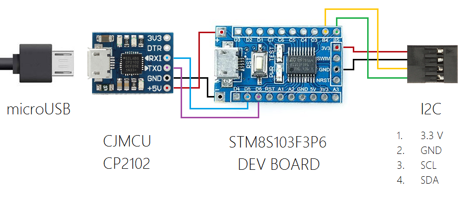

## usb-i2c-adapter

#### Description

The goal is to create a simple USB to I2C bridge. It must be able to operate as I2C master device in both transmitter and receiver modes. Optionally it must provide interface to additional features or configuration. Adapter must be able to use on PC, router, RPi or any other device with USB host.

---

#### Hardware design

Hardware is based on ready modules: usb-uart bridge and microcontroller development board.

---

#### Communication protocol

All actions are based on transmitting a command followed by required number of argumens. Every request is followed by success or failure response.

Response is unified. First byte is a prefix with number of following bytes. `00h` means that failure happened during command execution and payload size is zero, what means it is not followed by another data related to this request. Successful command execution has size of response payload followed by set of bytes with response.

##### List of commands

 - **Write** - `00h, address, register, numbytes, byte1, [..., byteN]` -> `numbytes, [byte1, ..., byteN]`
 
 - **Read** - `01h, address, register, numbytes` -> `numbytes, [byte1, ..., byteN]`

 - **Detect devices** - `02h, numbytes, [address1, ..., addressN]` -> `numbytes, [address1, ..., addressN]`

##### Examples

 - write one byte `2Eh` into register `F4h` of device with address `77h`
 
   TX: `00h 77h F4h 01h 2Eh` - request a sample of temperature value from BMP180 barometer
   
   RX: `01h 2Eh` - success, request sent
   
 - write two bytes `F0h 0Fh` into register `64h` of device with address `60h`
 
   TX: `00h 60h 64h 02h F0h 0Fh` - convert digit `F0h 0Fh` to analog value on MCP4725 DAC device
   
   RX: `00h` - failure, MCP4725 DAC device may be not connected on the bus
   
 - read three bytes from register `0Ah` of device with address `1Eh`
 
   TX: `01h 1Eh 0Ah 03h` - read chip ID value of HMC5883L compass
   
   RX: `03h 48h 34h 33h` - success, three bytes of chip ID received
   
 - read single byte from register `FEh` of device with address `40h` which is disconnected from the bus
 
   TX: `01h 40h FEh 01h` - read prescaler value of PCA9685 PWM controller
   
   RX: `00h` - failure, PCA9685 PWM controller may be not connected on the bus
   
 - detect presence of device with address `69h` on the bus
 
   TX: `02h 01h 69h` - check that MPU6050 IMU is on the bus
   
   RX: `01h 69h` - device was found
   
 - detect all present devices on the bus
 
   TX: `02h 00h` - scan all valid range of addresses for presence (`03h, ..., 77h`)
   
   RX: `03h 1Eh 69h 77h` - three devices was detected: HMC5883L compass, MPU6050 IMU and BMP180 barometer
   
 - detect presence of device with address `40h` on the bus
 
   TX: `02h 01h 40h` - check that PCA9685 PWM controller is on the bus
   
   RX: `00h` - no device with address `40h` was found
   
---

#### Software design

Adapter code is realized as a state machine. It is a loop of four states: initialization, command receipt, command execution and response with execution result.

---
